# Terraform + Amazon EKS + Helm + Argo CD GitOps


A production-style Kubernetes GitOps project that provisions an Amazon EKS environment with Terraform, installs Argo CD using Helm, packages an Nginx application as a Helm chart, and uses Argo CD to continuously synchronize the application from GitHub to Kubernetes.

The project demonstrates the workflow:

**Terraform → Amazon EKS → Helm → Argo CD → GitHub → Kubernetes**

---

## 📑 Table of Contents

- [Project Overview](#-project-overview)
- [Project Objectives](#-project-objectives)
- [Architecture](#-architecture)
- [Technologies Used](#-technologies-used)
- [1. Terraform Infrastructure Deployment](#1-terraform-infrastructure-deployment)
- [2. Amazon EKS Cluster](#2-amazon-eks-cluster)
- [3. EKS Worker Nodes](#3-eks-worker-nodes)
- [4. Helm Installation — Argo CD](#4-helm-installation--argo-cd)
- [5. Helm Chart Structure](#5-helm-chart-structure)
- [6. Helm Validation](#6-helm-validation)
- [7. Argo CD Application UI](#7-argo-cd-application-ui)
- [8. Argo CD Application Configuration](#8-argo-cd-application-configuration)
- [9. Kubernetes Application Running](#9-kubernetes-application-running)
- [10. GitOps Change — Git Change Pushed](#10-gitops-change--git-change-pushed)
- [11. Argo CD Detected the GitOps Change](#11-argo-cd-detected-the-gitops-change)
- [12. EKS Actually Has 3 Replicas](#12-eks-actually-has-3-replicas)
- [13. Argo CD Self-Healing](#13-argo-cd-self-healing)
- [Project Structure](#-project-structure)
- [Complete GitOps Workflow](#-complete-gitops-workflow)
- [GitOps Principles Demonstrated](#-gitops-principles-demonstrated)
- [Verification Commands](#-verification-commands)
- [Final Project State](#-final-project-state)
- [Project Screenshots](#-project-screenshots)
- [Key Takeaways](#-key-takeaways)
- [Author](#-author)
- [License](#-license)

---

## 📌 Project Overview

This project demonstrates how to provision and manage a Kubernetes environment on AWS using Infrastructure as Code, Helm, and GitOps principles.

Terraform is responsible for provisioning the AWS infrastructure and Amazon EKS environment.

Helm is used for two separate purposes:

1. Installing Argo CD into the EKS cluster.
2. Packaging the Nginx application as a reusable Helm chart.

Argo CD monitors the GitHub repository and continuously reconciles the Kubernetes cluster with the desired state stored in Git.

### Important clarification

Helm did **not** directly install Nginx.

The responsibilities are separated as follows:

* **Terraform** provisions the AWS infrastructure and EKS environment.
* **Helm** installs Argo CD.
* **Helm chart** defines the desired Kubernetes resources for the Nginx application.
* **Argo CD** reads the Helm chart from GitHub and synchronizes it to EKS.
* **Kubernetes** runs the Nginx application.

The GitOps flow is:

```
GitHub
   │
   │ Desired state
   ▼
Argo CD
   │
   │ Reads Helm chart
   ▼
Helm Chart
   │
   │ Renders Kubernetes manifests
   ▼
Amazon EKS
   │
   ▼
Nginx Application
```

---

## 🎯 Project Objectives

This project demonstrates practical experience with:

* Infrastructure as Code using Terraform
* AWS VPC networking
* Amazon EKS
* EKS managed node groups
* Private Kubernetes worker nodes
* NAT Gateways
* Kubernetes administration
* Helm package management
* Helm chart development
* Argo CD
* GitOps continuous delivery
* Git-based source of truth
* Automated synchronization
* Configuration drift detection
* Argo CD self-healing

---

## 🏗️ Architecture

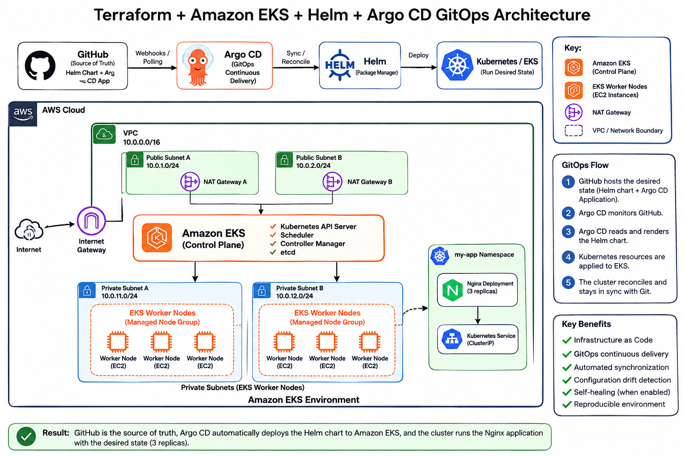

Terraform provisions the AWS networking and EKS infrastructure.

---

## 🛠️ Technologies Used

| Technology | Purpose                                   |
| ---------- | ----------------------------------------- |
| AWS        | Cloud infrastructure                      |
| Amazon VPC | Network infrastructure                    |
| Amazon EKS | Managed Kubernetes cluster                |
| Terraform  | Infrastructure as Code                    |
| Kubernetes | Container orchestration                   |
| Helm       | Kubernetes package management             |
| Argo CD    | GitOps continuous delivery                |
| Nginx      | Sample application                        |
| GitHub     | Source control and GitOps source of truth |
| PowerShell | Local administration and deployment       |

---

### Network architecture

```
VPC
│
├── Public Subnet A
│   └── NAT Gateway A
│
├── Public Subnet B
│   └── NAT Gateway B
│
├── Private Subnet A
│   └── EKS Worker Node
│
└── Private Subnet B
    └── EKS Worker Node
```

### Terraform commands

```
terraform init

terraform validate

terraform plan

terraform apply
```

Terraform successfully provisioned the AWS infrastructure and EKS environment.

### EKS environment

```
Cluster: kubernetes-gitops-eks
Region: us-east-1
```

The exact Kubernetes and AWS resource versions should be taken from the actual Terraform and AWS outputs rather than hard-coded in the README.

## 1. Terraform Infrastructure Deployment

Terraform was used to provision the AWS infrastructure required for the EKS environment.

The infrastructure includes:

* VPC
* Internet Gateway
* Public subnets
* Private subnets
* Route tables
* NAT Gateways
* Elastic IP addresses
* Security groups
* IAM roles
* Amazon EKS cluster
* EKS managed node group

The EKS worker nodes are deployed in private subnets.

---

### Screenshot 1 — Terraform Infrastructure Deployment

Show the successful Terraform deployment and relevant Terraform outputs.

Recommended evidence includes:

* EKS cluster name
* EKS cluster endpoint
* EKS cluster ARN
* Node group information
* VPC ID
* Subnet information
* NAT Gateway information

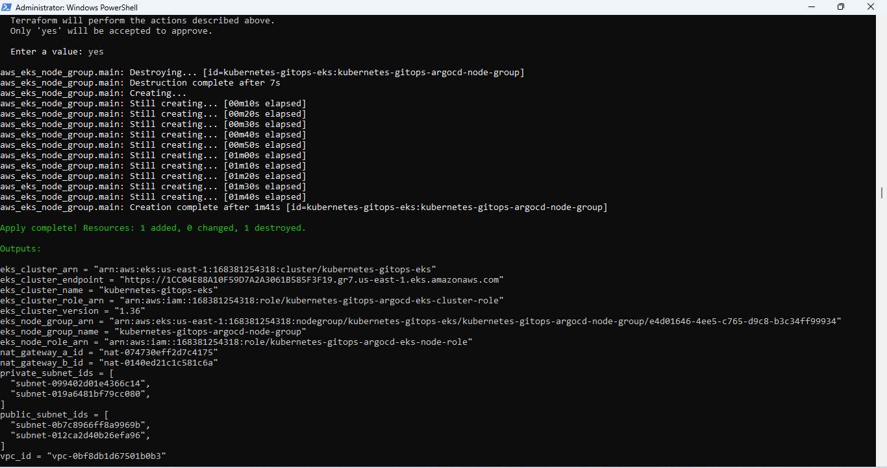

---

## 2. Amazon EKS Cluster

The Kubernetes environment was created using Amazon EKS.

Cluster name:

```
kubernetes-gitops-eks
```

Region:

```
us-east-1
```

The cluster can be verified using:

```
aws eks describe-cluster `
  --name kubernetes-gitops-eks `
  --region us-east-1
```

The cluster should report an active status after successful provisioning.

### Screenshot 2 — AWS EKS Cluster

Show the AWS EKS console displaying the `kubernetes-gitops-eks` cluster and its active status.

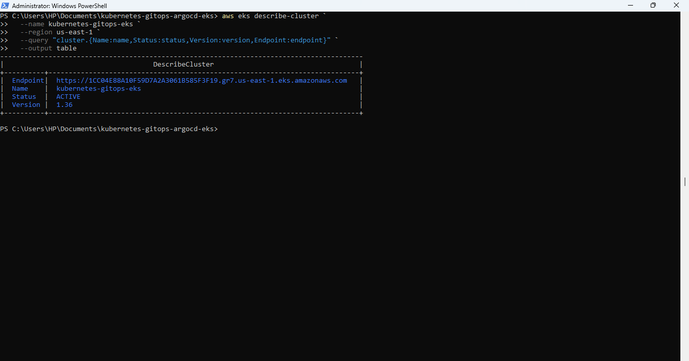

---

## 3. EKS Worker Nodes

The EKS cluster uses a managed node group to provide Kubernetes worker nodes.

The nodes were verified using:

```
kubectl get nodes
```

The worker nodes should report:

```
STATUS
Ready
```

The worker nodes are deployed in the private subnets created by Terraform.

### Screenshot 3 — EKS Worker Nodes

Show `kubectl get nodes` with the EKS worker nodes displaying `Ready`.

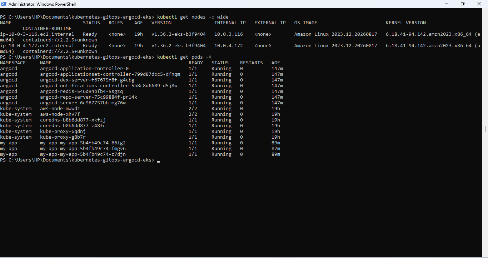

---

## 4. Helm Installation — Argo CD

Helm was used to install Argo CD into the EKS cluster.

The Argo Helm repository was added using:

```
helm repo add argo https://argoproj.github.io/argo-helm
```

The repository was updated using:

```
helm repo update
```

The Argo CD namespace was created using:

```
kubectl create namespace argocd
```

Argo CD was installed using:

```
helm install argocd argo/argo-cd `
  --namespace argocd `
  --timeout 10m
```

The Helm release was verified using:

```
helm list -n argocd
```

The release should show Argo CD with a deployed status.

### Screenshot 4 — Helm Installation of Argo CD

Show the successful Helm installation and the output of:

```
helm list -n argocd
```

The screenshot should clearly show the Argo CD release as deployed.

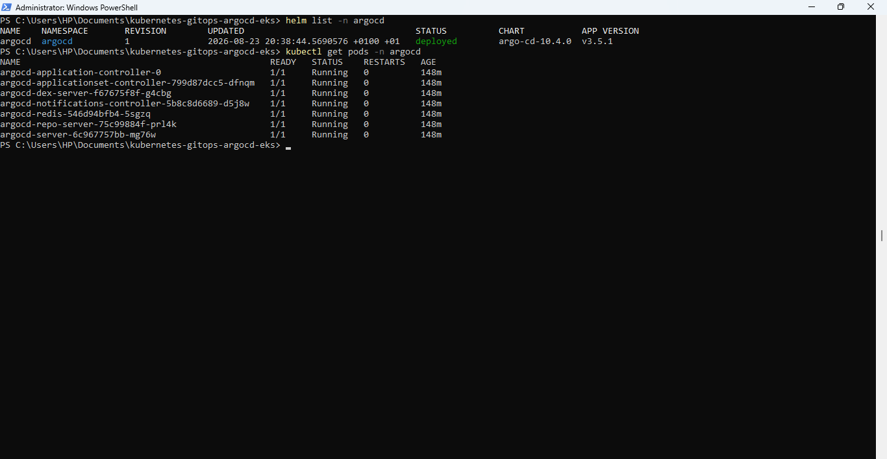

---

## 5. Helm Chart Structure

A custom Helm chart was created for the Nginx application.

The chart is located at:

```
helm/my-app/
```

The relevant chart structure is:

```
helm/
└── my-app/
    ├── Chart.yaml
    ├── values.yaml
    └── templates/
        ├── deployment.yaml
        ├── service.yaml
        └── ingress.yaml
```

The exact files displayed in this section should match the files present in the repository.

### Chart.yaml

`Chart.yaml` contains the Helm chart metadata, including:

* Chart API version
* Chart name
* Chart description
* Chart type
* Chart version
* Application version

### values.yaml

The application configuration includes values such as:

```
replicaCount: 3

image:
  repository: nginx
  tag: "1.27"
  pullPolicy: IfNotPresent

service:
  type: ClusterIP
  port: 80

resources:
  requests:
    cpu: 50m
    memory: 64Mi
  limits:
    cpu: 100m
    memory: 128Mi
```

These values are consumed by the Helm templates to generate the Kubernetes resources.

### Screenshot 5 — Helm Chart Structure

Show the `helm/my-app` directory and its chart files.

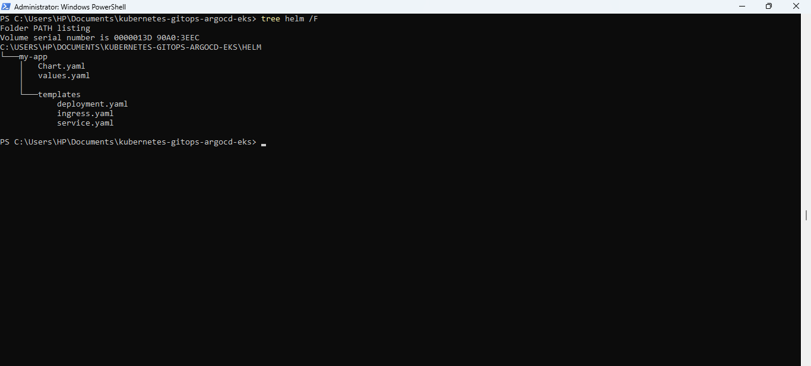

---

## 6. Helm Validation

The Helm chart was validated before deployment.

The chart was checked using:

```
helm lint helm/my-app
```

The validation should return:

```
1 chart(s) linted, 0 chart(s) failed
```

The chart was also rendered locally using:

```
helm template my-app helm/my-app
```

This verifies that Helm can successfully render the Kubernetes manifests from the chart.

The rendered resources include the application's Deployment and Service.

### Screenshot 6 — Helm Validation

Show:

```
helm lint helm/my-app
```

with the successful validation result.

Also show the `helm template` output containing the generated Kubernetes resources.

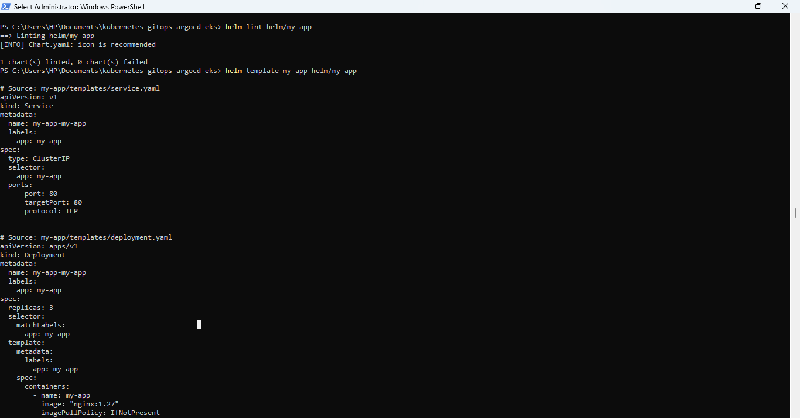

---

## 7. Argo CD Application UI

Argo CD provides the GitOps interface for the application.

The application created for this project is:

```
my-app
```

The Argo CD dashboard showed:

```
Sync Status: Synced
Health Status: Healthy
```

This confirms that Argo CD successfully synchronized the desired state from Git with the Kubernetes cluster.

### Screenshot 7 — Argo CD Application UI

Show the Argo CD Application page displaying:

```
my-app
Synced
Healthy
```

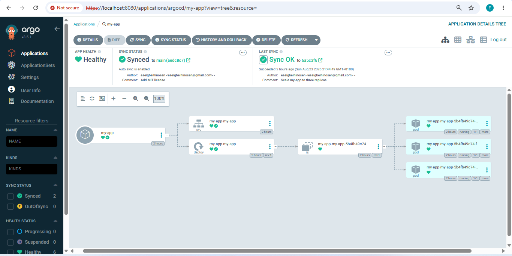

---

## 8. Argo CD Application Configuration

The Argo CD Application manifest is stored in:

```
argocd/my-app.yaml
```

The configuration connects Argo CD to the GitHub repository and Helm chart.

The Application configuration includes:

```
apiVersion: argoproj.io/v1alpha1
kind: Application

metadata:
  name: my-app
  namespace: argocd

spec:
  project: default

  source:
    repoURL: https://github.com/eseigbeihinosen/kubernetes-gitops-argocd-eks.git
    targetRevision: main
    path: helm/my-app

    helm:
      releaseName: my-app

  destination:
    server: https://kubernetes.default.svc
    namespace: my-app

  syncPolicy:
    automated:
      prune: true
      selfHeal: true
    syncOptions:
      - CreateNamespace=true
```

This configuration tells Argo CD:

* Which GitHub repository to monitor
* Which branch contains the desired state
* Which directory contains the Helm chart
* Which Kubernetes cluster to deploy to
* Which namespace to use
* To automatically synchronize changes
* To prune resources removed from Git
* To self-heal configuration drift
* To create the application namespace automatically

The Application was created using:

```
kubectl apply -f argocd/my-app.yaml
```

### Screenshot 8 — Argo CD Application Configuration

Show the Argo CD Application details/configuration displaying:

* Application name
* Git repository
* Target revision
* Path: `helm/my-app`
* Destination cluster
* Namespace: `my-app`
* Automated synchronization
* Prune
* Self-heal

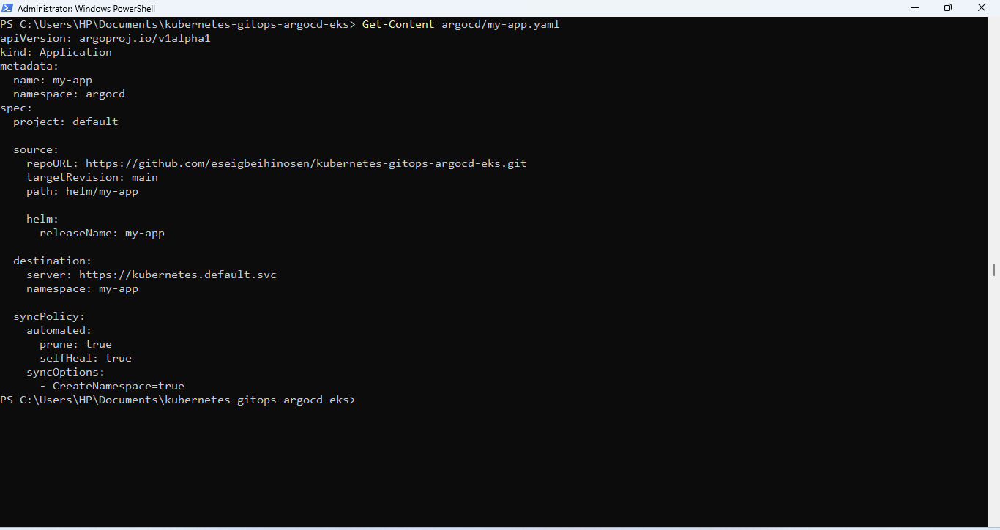

---

## 9. Kubernetes Application Running

After Argo CD synchronized the Helm chart, Kubernetes resources were created in the `my-app` namespace.

The deployed resources include:

* Nginx Deployment
* Nginx Pods
* ClusterIP Service
* ReplicaSet

The application was verified using:

```
kubectl get all -n my-app
```

The application uses the Nginx image configured in the Helm chart:

```
nginx:1.27
```

### Screenshot 9 — Kubernetes Application Running

Show:

```
kubectl get all -n my-app
```

The screenshot should show the Deployment, Pods, Service, and ReplicaSet running successfully.

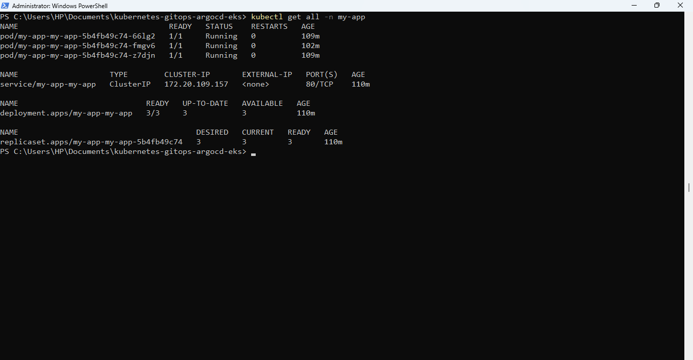

---

## 10. GitOps Change — Git Change Pushed

The GitOps workflow was demonstrated by changing the desired replica count.

The Helm value was changed from:

```
replicaCount: 2
```

to:

```
replicaCount: 3
```

The change was committed using:

```
git add helm/my-app/values.yaml

git commit -m "Scale my-app to three replicas"
```

The change was then pushed to GitHub:

```
git push origin main
```

The commit created for this change was:

```
6a5c3f63309ca3c656950a4f3bb5148f79593494
```

This change updated the desired application state stored in GitHub.

### Screenshot 10 — Git Change Pushed

Show the terminal containing:

```
git commit -m "Scale my-app to three replicas"
```

and:

```
git push origin main
```

The screenshot should clearly show the commit being pushed successfully to the `main` branch.

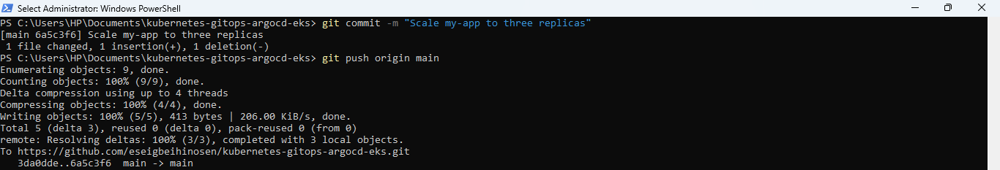

---

## 11. Argo CD Detected the GitOps Change

Argo CD monitors the GitHub repository for changes to the desired state.

The Argo CD synchronization revision was verified using:

```
kubectl get application my-app -n argocd -o jsonpath="{.status.sync.revision}"
```

Argo CD reported the same commit SHA as the local Git repository:

```
6a5c3f63309ca3c656950a4f3bb5148f79593494
```

The local Git revision was verified using:

```
git rev-parse HEAD
```

Result:

```
6a5c3f63309ca3c656950a4f3bb5148f79593494
```

The matching commit hashes demonstrate that Argo CD synchronized the exact Git revision pushed to GitHub.

The Application was also verified using:

```
kubectl get applications -n argocd
```

Result:

```
NAME     SYNC STATUS   HEALTH STATUS
my-app   Synced        Healthy
```

### Screenshot 11 — Argo CD Detected the GitOps Change

Show the Argo CD Application after the Git change.

The screenshot should show:

* Application: `my-app`
* Sync status: `Synced`
* Health status: `Healthy`
* Updated Git revision, if visible in the UI

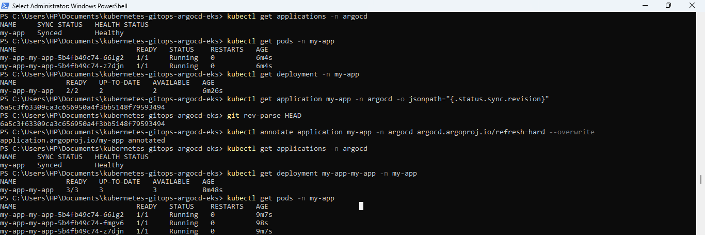

---

## 12. EKS Actually Has 3 Replicas

After Argo CD synchronized the updated Helm values, Kubernetes updated the Deployment from two replicas to three.

The Deployment was verified using:

```
kubectl get deployment my-app-my-app -n my-app
```

The final state was:

```
NAME            READY   UP-TO-DATE   AVAILABLE
my-app-my-app   3/3     3            3
```

The Pods were also verified using:

```
kubectl get pods -n my-app
```

Three Nginx Pods were running successfully.

This demonstrates the complete GitOps change flow:

```
Git change
    ↓
GitHub
    ↓
Argo CD detects commit
    ↓
Argo CD synchronizes Helm chart
    ↓
Helm values change
    ↓
Kubernetes Deployment updated
    ↓
Replica count changes from 2 → 3
    ↓
Three Pods running
```

### Screenshot 12 — EKS Actually Has 3 Replicas

Show:

```
kubectl get deployment my-app-my-app -n my-app
```

with the Deployment showing:

```
3/3     3     3
```

Also show:

```
kubectl get pods -n my-app
```

with three running Pods.

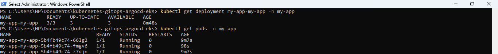

---

## 13. Argo CD Self-Healing

Argo CD was configured with automated synchronization, pruning, and self-healing:

```
syncPolicy:
  automated:
    prune: true
    selfHeal: true
```

The `selfHeal` setting allows Argo CD to detect differences between the desired state stored in Git and the live Kubernetes state.

For example, if the Deployment is manually scaled down:

```
kubectl scale deployment my-app-my-app -n my-app --replicas=2
```

the live Kubernetes state temporarily differs from the desired state stored in Git.

Git still defines:

```
replicaCount: 3
```

With self-healing enabled, Argo CD can detect this drift and reconcile the Deployment back to the desired state.

The final state can be verified using:

```
kubectl get deployment my-app-my-app -n my-app
```

Expected state:

```
NAME            READY   UP-TO-DATE   AVAILABLE
my-app-my-app   3/3     3            3
```

### Important

The self-healing section should be described as a **demonstrated test** only if the Deployment was actually changed manually and Argo CD restored it to three replicas.

### Screenshot 13 — Argo CD Self-Healing

The strongest evidence should show:

1. The Deployment being manually changed from the Git-defined state.
2. Argo CD detecting the drift.
3. Argo CD automatically reconciling the application.
4. The Application returning to `Synced` and `Healthy`.
5. Kubernetes returning to three replicas.

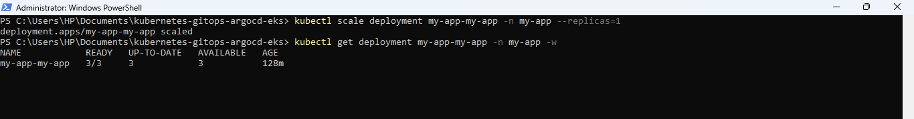

---

## 📁 Project Structure

The final repository contains only the components that are part of this Terraform + EKS + Helm + Argo CD GitOps project:

```
kubernetes-gitops-argocd-eks/
│
├── argocd/
│   └── my-app.yaml
│
├── helm/
│   └── my-app/
│       ├── Chart.yaml
│       ├── values.yaml
│       └── templates/
│           ├── deployment.yaml
│           ├── service.yaml
│           └── ingress.yaml
│
├── terraform/
│   ├── provider.tf
│   ├── versions.tf
│   ├── variables.tf
│   ├── terraform.tfvars
│   ├── locals.tf
│   ├── vpc.tf
│   ├── subnet.tf
│   ├── internet-gateway.tf
│   ├── route-table.tf
│   ├── nat-gateway.tf
│   ├── security-groups.tf
│   ├── iam.tf
│   ├── eks.tf
│   └── outputs.tf
│
├── .gitignore
├── LICENSE
└── README.md
```

No application source-code directory or GitHub Actions workflow is required for this project because the project focuses on:

**Terraform + EKS + Helm + Argo CD GitOps.**

---

## 🔄 Complete GitOps Workflow

### Step 1 — Provision Infrastructure

Terraform provisions the AWS infrastructure:

```
Terraform
    ↓
VPC
    ↓
Public + Private Subnets
    ↓
NAT Gateways
    ↓
IAM
    ↓
Amazon EKS
    ↓
Managed Node Group
```

### Step 2 — Install Argo CD

Helm installs Argo CD into EKS:

```
Helm
    ↓
Argo CD
    ↓
argocd namespace
    ↓
Argo CD components
```

### Step 3 — Create the Application Helm Chart

The Nginx application is packaged as:

```
helm/my-app/
    │
    ├── Chart.yaml
    ├── values.yaml
    └── templates/
        ├── deployment.yaml
        ├── service.yaml
        └── ingress.yaml
```

### Step 4 — Configure Argo CD

The Argo CD Application points to:

```
GitHub repository
       ↓
main branch
       ↓
helm/my-app
```

### Step 5 — Deploy the Application

Argo CD reads the Helm chart from Git and synchronizes it to EKS:

```
GitHub
   ↓
Argo CD
   ↓
Helm Chart
   ↓
Kubernetes manifests
   ↓
EKS
   ↓
Nginx
```

### Step 6 — Change the Desired State

The replica count was changed from:

```
replicaCount: 2
```

to:

```
replicaCount: 3
```

The change was committed and pushed:

```
git add helm/my-app/values.yaml
    ↓
git commit
    ↓
git push
    ↓
GitHub
```

### Step 7 — Argo CD Reconciles

Argo CD detects the new Git revision:

```
GitHub
   ↓
Argo CD
   ↓
Detects new commit
   ↓
Synchronizes
   ↓
Helm renders updated configuration
   ↓
Kubernetes Deployment updated
```

### Step 8 — Kubernetes Reaches Desired State

The Deployment changes from:

```
2 replicas
```

to:

```
3 replicas
```

Final result:

```
3/3 replicas available
```

---

## 🔐 GitOps Principles Demonstrated

## Declarative Configuration

The desired application state is defined as code through the Helm chart.

## Git as the Source of Truth

The GitHub repository contains the desired application configuration used by Argo CD.

## Automated Synchronization

Argo CD automatically synchronizes changes from Git.

## Drift Detection

Argo CD compares the desired state stored in Git with the live Kubernetes state.

## Self-Healing

With `selfHeal: true`, Argo CD can automatically correct supported configuration drift.

## Reproducibility

The infrastructure and application configuration are stored as code, allowing the environment to be recreated consistently.

---

## 🧪 Verification Commands

### Verify Terraform

```
terraform validate
```

### Verify EKS Cluster

```
aws eks describe-cluster `
  --name kubernetes-gitops-eks `
  --region us-east-1
```

### Verify Worker Nodes

```
kubectl get nodes
```

### Verify Argo CD Pods

```
kubectl get pods -n argocd
```

### Verify Helm Releases

```
helm list -n argocd
```

### Validate Helm Chart

```
helm lint helm/my-app
```

### Render Helm Templates

```
helm template my-app helm/my-app
```

### Verify Argo CD Applications

```
kubectl get applications -n argocd
```

### Verify Application Resources

```
kubectl get all -n my-app
```

### Verify Deployment Replicas

```
kubectl get deployment my-app-my-app -n my-app
```

### Verify Pods

```
kubectl get pods -n my-app
```

### Verify Git Revision

```
git rev-parse HEAD
```

### Verify Argo CD Revision

```
kubectl get application my-app -n argocd -o jsonpath="{.status.sync.revision}"
```

---

## 📊 Final Project State

| Component                 | Status          |
| ------------------------- | --------------- |
| Terraform infrastructure  | Deployed        |
| Amazon VPC                | Deployed        |
| NAT Gateways              | Deployed        |
| Amazon EKS cluster        | Active          |
| EKS managed node group    | Active          |
| EKS worker nodes          | Ready           |
| Helm                      | Installed       |
| Argo CD                   | Deployed        |
| Argo CD pods              | Running         |
| Helm chart                | Validated       |
| GitHub repository         | Source of truth |
| Argo CD Application       | Synced          |
| Application health        | Healthy         |
| Nginx application         | Running         |
| Desired replicas          | 3               |
| Running replicas          | 3               |
| Automated synchronization | Enabled         |
| Prune                     | Enabled         |
| Self-healing              | Enabled         |

---

## 📸 Project Screenshots

The project evidence includes:

1. Terraform infrastructure deployment
2. AWS EKS cluster
3. EKS worker nodes
4. Helm installation of Argo CD
5. Helm chart structure
6. Helm validation
7. Argo CD Application UI
8. Argo CD Application configuration
9. Kubernetes application running
10. Git change pushed
11. Argo CD detected the GitOps change
12. EKS actually has three replicas
13. Argo CD self-healing

Together, these screenshots demonstrate the project from infrastructure provisioning through Kubernetes deployment, GitOps synchronization, configuration changes, and self-healing.

---

## 🚀 Key Takeaways

This project demonstrates practical experience with:

* AWS cloud infrastructure
* Terraform Infrastructure as Code
* Amazon VPC
* Amazon EKS
* Kubernetes
* Helm
* Argo CD
* GitOps
* GitHub
* Automated application synchronization
* Declarative application configuration
* Configuration drift detection
* Kubernetes reconciliation
* Self-healing deployments

The project demonstrates how AWS infrastructure can be provisioned with Terraform and how applications running on Kubernetes can subsequently be managed through a GitOps workflow using Helm, Argo CD, and GitHub.

The core workflow is:

```
Terraform
    ↓
Amazon EKS
    ↓
Helm
    ↓
Argo CD
    ↓
GitHub
    ↓
Helm Chart
    ↓
Kubernetes
    ↓
Nginx
    ↓
Git Change
    ↓
Argo CD Reconciliation
    ↓
Updated Kubernetes State
```

---

## 👨‍💻 Author

**Eseigbe Ihinosen**

Cloud / DevOps / Cybersecurity Enthusiast

GitHub: https://github.com/eseigbeihinosen

---

## 📜 License

This project is licensed under the MIT License. See the `LICENSE` file for details.
